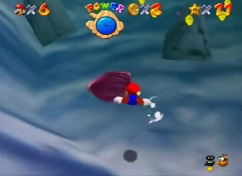
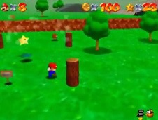
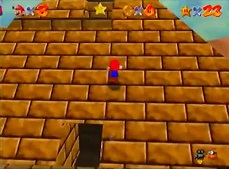
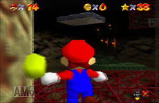
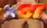
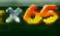
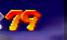

# Star-Classifier-For-Mario-64

Classifies how many stars you have in Super Mario 64 using images

## Benefits


More precise than manually splitting

Ability to get split times live or from an existing video

Makes splitting at each star viable


## To run

Requirements:
* Python 3.6
* Tensorflow library (or any other backend library like Theano, testing was done on Tensorflow)
* Keras library
* MSS library
* Pillow Library
* Numpy Library


## High level functions

__init__.py - starts the program


## Data


### Data Information

Image fed to neural network is cropped image of star number.


 
 




### Data gathering

Data was gathered by downloading videos of speedrunners and putting it in the correct folder depending on how many stars they have

### Data labels

Output is a one-hot encoding from 0 to 120 of how many stars you have

2 more binary targets were added as 121 (black screen) and 122 (white screen)

### Data directory structure


```
.
+-- mario64_images
|   +-- 0
|   |	+-- Images from Player1
|   |   |	+-- img1.png
|   |   |	+-- img2.png
|   |   |	+-- img3.png
|   |	+-- Images from Player2
|   |   |	+-- img1.jpg
|   |   |	+-- img2.jpg
|   |   |	+-- img300.jpg
|   +-- 1
|   |	+-- Images from Player20
|   |   |	+-- img100.png
|   +-- 2
|   +-- 3
|   +-- 4
...
|   +-- 120


```

This is how data is stored for training


### Data Modifications/Preprocessing


#### Generated images

 
 
 
 



More training data was used by generating images that were shifted and had color changes.  Keras.preprocessing library helped with this.  Look at /src/preprocess.py for more information

### Fast screenshot tools tested

* PIL library - PIL library comes with a screenshot utility
* MSS library - Was than PIL library, this is the current method used
* win32 API - Supposed to be faster, could not get screenshots to work with this API


### Current Application Speed


The program is able to screenshot and classify how many stars you have in less than a frame. Super Mario 64 runs in 29.97 frames per second (NTSC)

Taking a screenshot is the biggest bottleneck in the application speed.


### Batch normalization, weight initialization

Batch normalization, weight initialization, normalizing input helped in lowering training time


## Model
* 3 Convolution hidden layers with 32, 32, and 16 convolutions per layer
* Max pooling after every convolution hidden layer
* 1 Dense hidden layer with 128 units after convolution and pooling layers
* Relu for hidden layers, Softmax for output
* Batch normalization after every hidden layer, he uniform weight initialization
* L2 Regularization 0.0001
* Loss function: Categorical Cross entropy
* Optimizer: Nadam, learning rate of 0.0006


### Results

In the final version of the model, it classified with an accuracy of over 99%.  The model provided was trained until validation loss would no longer decrease.

The application works well when running in real time.  


## Author
Gerardo Cervantes
