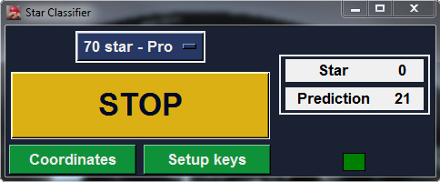
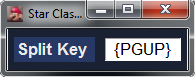
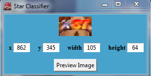

# Star Classifier For Mario 64

Can auto-split by recognizing how many stars you have in the game.  A deep learning model is used to recognize how many stars the player has from an image.


## Release

Latest release (v0.95) can be found [here](https://github.com/gcervantes8/Star-Classifier-For-Mario-64/releases)


## Features


More precise than manually splitting

Can be ran on a video or be used live

You can modify when to split, e.g. at every star


## Running the release

Star-Classifier.exe opens the application you downloaded from the release page


## How to use

### Main menu

 

The dropdown has the different routes you can use

Custom routes can be created and edited by modifying the routes directory


### Key setup

 

The key you use to split on LiveSplit can be changed here

The keys used for splitting can be found in the following link - [here](https://docs.microsoft.com/en-us/dotnet/api/system.windows.forms.sendkeys?redirectedfrom=MSDN&view=netframework-4.7.2)


### Coordinates setup

 

The coordinates should be set so it takes a screenshot of the star counter in the game, use the preview button to know the location of coordinates.

The coordinates needs to be the star counter in your game, look at the example images for reference

 
#### Example images

 
 


 ## Creating a route

Routes that are in the dropdown end with the .route extension and are all located in the routes directory

Routes are editable by opening them with notepad, notepad++, or any other text editing program

Route files use the JSON format, keep the JSON format or the route will not work


* name:  This is the name of your route

* fadeout_splits: This contains star numbers you want split in fadeouts

* fadeout_amount: This is how many fadeouts you want to split after the corresponding fadeout_split

* immediate_splits: If you want to split at the same time you get a star you add it here

* starting_star_number: Star number you are starting with


The first item in fadeout_splits corresponds to the first item in fadeout_amount

The second item in fadeout_splits corresponds to the second item in fadeout_amount

etc.


So the amount of numbers in fadeout_splits and fadeout_amounts should be the same because they are aligned

### Example:

Let's say we want to split in star 10's fadeout. 
 
You add a fadeout_split at 10 and make the fadeout_amount for that 1.


To add a split in the fadeout after getting the 1st bowser key you would add star 13 to fadeout_splits and make add 2 to fadeout_amounts.
You make the fadeout_amount 2 for star 13 because it's the 2nd fadeout after you get star 13.
After getting star 13, there is 1 fadeout that occurs after you go down the bowser pipe, and after you beat bowser and get the key there is another fadeout that occurs and this is where you want to split.
 

```json
...
"fadeout_splits": [10, 13], 
"fadeout_amounts": [1, 2]
...
```

## Not working? - Debug Guide

1. An application like F.lux, which changes the colors of the monitor should be disabled
2. Star number has to be clearly be seen, and shouldn't be blocked by any windows over it
3. The star image being screenshotted should be at a very similar position to the ones in the example images section
4. Run the application and check that the application is giving correct prediction, if it is, then it could be an unsupported split key.  Make sure you press Stop and then Start again after every reset.  
5. You can contact me or post on the Github issues pages to resolve the issue


## To run from source code

\_\_init\_\_.py starts the program

Requirements:
* Python 3.6
* Tensorflow library - Comes with numpy (other backend library like Theano can be used but wasn't tested on)
* Keras library
* MSS library
* Pillow Library
* pyautogui library
* pywin32

Information on training can be found [here](https://github.com/gcervantes8/Star-Classifier-For-Mario-64/blob/master/src/train_model_code/README.md)

## Author
Gerardo Cervantes
