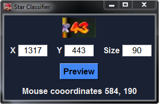
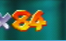

# Star-Classifier-For-Mario-64

Classifies how many stars you have in Super Mario 64 using images

## Benefits


More precise than manually splitting

Ability to get split times live or from an existing video

Makes splitting at each star viable


## To run from source code

Requirements:
* Python 3.6
* Tensorflow library - Comes with numpy (other backend library like Theano can be used but wasn't tested on)
* Keras library
* MSS library
* Pillow Library
* pywin32


## High level function

\_\_init__.py - starts the program


## How to use

### Main menu

 


You select the route you want to use from the dropdown 

Add custom routes by adding them to the routes directory


### Key setup

 

The key you use to split on LiveSplit goes here

There are the keys you can use to split:


https://docs.microsoft.com/en-us/dotnet/api/system.windows.forms.sendkeys?redirectedfrom=MSDN&view=netframework-4.7.2


### Coordinates setup

 

Click preview to take a screenshot at the coordinates


You want the coordinates to be the star counter in your game


Take a screenshot from a high quality version of your game.  You can make amarec or OBS bigger and have it take a screenshot from there. A width to height ratio of 1.675 is best (not necessary) 


This program takes screenshots of that place multiple times, so don't move that window or put other windows over it
 

 
#### Example image

 


 ## Creating a route

Routes end with the .route extension and are all located in the routes directory

To edit one you open it with notepad or notepad++ to make changes to it

Route files use the JSON format so make sure to keep the JSON format or it might result in some errors


* name:  This is the name of your route

* fadeout_splits: This contains star numbers you want split in fadeouts

* fadeout_amount: This is how many fadeouts you want to split after the corresponding fadeout_split

* immediate_splits: If you want to split at the same time you get a star you add it here

* starting_star_number: Star number you are starting with


The first item in fadeout_splits corresponds to the first item in fadeout_amount

The second item in fadeout_splits corresponds to the second item in fadeout_amount

etc.


So the amount of items in fadeout_splits and and fadeout_amounts should be the same because they are aligned

### Example:

Let's say we want to split in star 10's fadeout and after you get a bowser key. 
 
After you get star 10 you want to split after the first fadeout, so you add a fadeout_split at 10 and make the fadeout_amount for that 1


For splitting at bowser key:
After getting star 13, there is 1 fadeout that occurs after you go down the bowser pipe, and after you beat bowser and get the key there is another fadeout that occurs and this is where you want to split.

So you make the fadeout_amount 2 for star 13 because it's the 2nd fadeout after you get star 13.


...

"fadeout_splits": [10, 13], 

"fadeout_amounts": [1, 2]

...
 

## Data used for training


### Data Information

Image fed to neural network is cropped image of star number.


 
 


### Data gathering

Data was gathered by downloading videos of speedrunners and putting it in the correct folder depending on how many stars they have

### Data labels

Output is a one-hot encoding from 0 to 120 of how many stars you have

2 more binary targets were added as 121 (black screen) and 122 (white screen)

### Data directory structure


```
.
+-- mario64_images
|   +-- 0
|   |	+-- Images from Player1
|   |   |	+-- img1.png
|   |   |	+-- img2.png
|   |   |	+-- img3.png
|   |	+-- Images from Player2
|   |   |	+-- img1.jpg
|   |   |	+-- img2.jpg
|   |   |	+-- img300.jpg
|   +-- 1
|   |	+-- Images from Player20
|   |   |	+-- img100.png
|   +-- 2
|   +-- 3
|   +-- 4
...
|   +-- 120


```

This is how data is stored for training


### Data Modifications/Preprocessing


#### Generated images

 
 
 
 


More training data was used by generating images that were shifted and had color changes.  Keras.preprocessing library helped with this.  Look at /src/train_model_code/preprocess.py for more information

### Fast screenshot tools tested

* PIL library - PIL library comes with a screenshot utility
* MSS library - Was than PIL library, this is the current method used
* win32 API - Supposed to be faster, could not get screenshots to work with this API


### Current Application Speed


The program is able to screenshot and classify how many stars you have in less than a frame. Super Mario 64 runs in 29.97 frames per second (NTSC)

Taking a screenshot is the biggest bottleneck in the application speed.


### Batch normalization, weight initialization

Batch normalization, weight initialization, normalizing input helped in lowering training time


## Model
* 3 Convolution hidden layers with 32, 32, and 16 convolutions per layer
* Max pooling after every convolution hidden layer
* 1 Dense hidden layer with 128 units after convolution and pooling layers
* Relu for hidden layers, Softmax for output
* Batch normalization after every hidden layer, he uniform weight initialization
* L2 Regularization 0.0001
* Loss function: Categorical Cross entropy
* Optimizer: Nadam, learning rate of 0.0006


### Results

In the final version of the model, it classified with an accuracy of over 99%.  The model provided was trained until validation loss would no longer decrease.

The application works well when running in real time.  


## Author
Gerardo Cervantes
